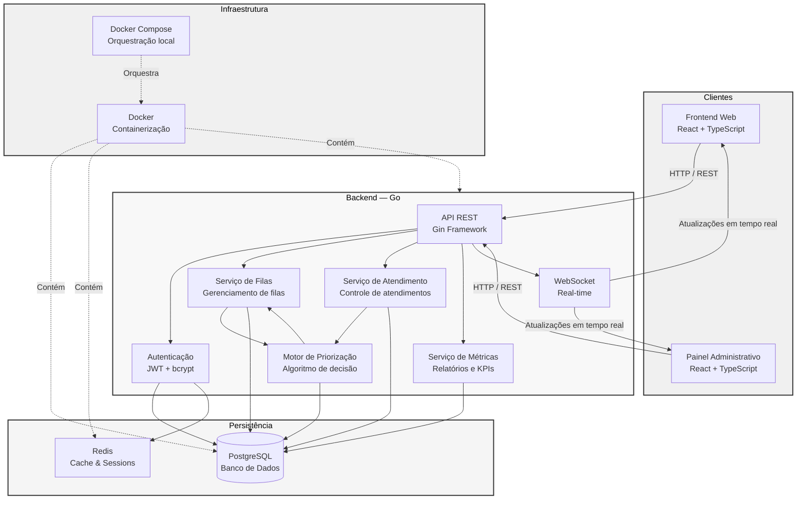

# 🚦 QFlow

### Plataforma Inteligente de Gestão e Otimização de Filas

O **QFlow** é uma plataforma para gerenciamento de filas de atendimento que utiliza **regras configuráveis de priorização e distribuição**, buscando reduzir o tempo de espera e otimizar a utilização dos atendentes.

A proposta é substituir filas baseadas exclusivamente na ordem de chegada por um sistema capaz de considerar diferentes fatores para definir a ordem de atendimento.

---

## 💡 Proposta

O QFlow utiliza um **motor de decisão** para determinar o próximo atendimento com base em fatores como:

-  Tempo de espera
-  Prioridade
-  Tipo de atendimento
-  Disponibilidade e compatibilidade dos atendentes
-  Regras configuradas pela organização

As regras podem ser adaptadas de acordo com o contexto de cada instituição.

### Possíveis aplicações

 Saúde ·  Bancos ·  Educação ·  Órgãos públicos ·  Suporte técnico ·  Centrais de atendimento

---

# 🏗️ Arquitetura
### Diagrama básico da arquitetura do software e suas ferramentas

---

## 🛠️ Tecnologias a serem utilizadas

---

## Autor do projeto
*projeto orientado ao primeiro semestre da matéria de engenharia de software I*

**Yuri Duarte Kerber Alves da Silva**

---

  <strong>QFlow — Transformando filas em fluxos inteligentes.</strong>

