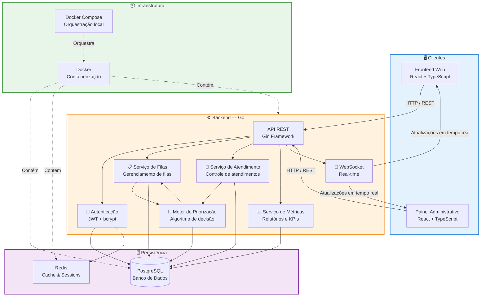

# Diagrama de Arquitetura - QFlow

## Visão Geral da Arquitetura

Arquitetura em camadas do QFlow, mostrando a interação entre Cliente, Backend, Banco de Dados e Infraestrutura.

---

## Componentes da Arquitetura

### Camada Cliente

| Componente | Tecnologia | Responsabilidade |
|---|---|---|
| **Frontend Web** | React + TypeScript | Interface para Cliente e Atendente |
| **Painel Administrativo** | React + TypeScript | Interface para Administrador |

### Camada Backend

| Componente | Tecnologia | Responsabilidade |
|---|---|---|
| **API REST** | Go + Gin Framework | Orquestra requisições HTTP e roteia para serviços |
| **Autenticação** | JWT + bcrypt | Valida credenciais, gera tokens, protege rotas |
| **Serviço de Filas** | Go | Cria, gerencia e organiza filas de atendimento |
| **Motor de Priorização** | Go | Calcula prioridade e determina próximo atendimento |
| **Serviço de Atendimento** | Go | Controla ciclo de vida do atendimento |
| **Serviço de Métricas** | Go | Coleta dados e gera relatórios/KPIs |
| **WebSocket** | Go | Envia atualizações em tempo real aos clientes |

### Camada de Persistência

| Componente | Tecnologia | Responsabilidade |
|---|---|---|
| **Banco de Dados** | PostgreSQL | Armazena dados persistentes (usuários, filas, atendimentos) |
| **Cache** | Redis | Armazena sessões, cache de operações frequentes |

### Camada de Infraestrutura

| Componente | Tecnologia | Responsabilidade |
|---|---|---|
| **Docker** | Docker | Containeriza aplicações para portabilidade |
| **Docker Compose** | Docker Compose | Orquestra containers em ambiente local/desenvolvimento |

---

## Decisões Arquiteturais

| Decisão | Justificativa |
|---|---|
| **Go para Backend** | Performance, concorrência, deployment simples |
| **PostgreSQL** | Confiabilidade, ACID, escalabilidade, suporte a JSON |
| **Redis** | Cache rápido, sessões, pub/sub para real-time |
| **React** | Ecosistema maduro, comunidade grande, SPA reativo |
| **WebSocket** | Atualizações instantâneas da fila e posição |
| **Docker** | Portabilidade, consistência entre ambientes |
| **JWT** | Stateless, escalável, seguro |

