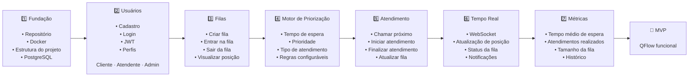

# Roadmap do MVP - QFlow

---

### MVP Final
Ao concluir todas as etapas, o projeto entrega uma primeira versão funcional do QFlow, capaz de demonstrar o valor central do sistema: organizar e otimizar filas por regras inteligentes, em vez de priorizar apenas a ordem de chegada.

---
