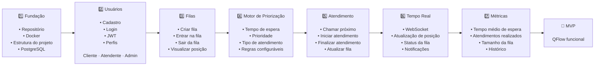

# Roadmap do MVP - QFlow

## O que é um roadmap de MVP?

Um roadmap de MVP (Minimum Viable Product) é um plano de desenvolvimento que mostra as etapas essenciais para entregar a primeira versão funcional do produto, com as funcionalidades mínimas necessárias para validar a ideia e testar o valor real para o usuário.

No caso do QFlow, o roadmap do MVP organiza as entregas em sequência lógica para que o sistema possa evoluir de forma controlada, começando pela base estrutural e finalizando com uma versão funcional do fluxo principal de filas e atendimento.

O objetivo é priorizar apenas o que é necessário para o produto funcionar e gerar aprendizado, sem entregar funcionalidades extras que ainda não são essenciais.

## Diagrama do Roadmap do MVP

---

## Explicação do Roadmap

### 1. Fundação
Esta etapa cria a base técnica do projeto:
- repositório organizado
- ambiente de desenvolvimento
- Docker
- estrutura inicial do backend e frontend
- banco PostgreSQL

### 2. Usuários
A primeira funcionalidade de negócio é a autenticação e a gestão de perfis:
- cadastro de usuários
- login
- autenticação via JWT
- separação de papéis: Cliente, Atendente e Administrador

### 3. Filas
Nesse passo, o sistema passa a gerenciar o fluxo principal de fila:
- criação de filas
- entrada do cliente na fila
- saída da fila
- acompanhamento da posição

### 4. Motor de Priorização
Aqui entra a principal ideia do projeto:
- tempo de espera
- nível de prioridade
- tipo de atendimento
- regras configuráveis pela organização

### 5. Atendimento
Após a fila estar organizada, o sistema precisa permitir o atendimento real:
- chamar próximo cliente
- iniciar o atendimento
- finalizar atendimento
- atualizar a fila e os status

### 6. Tempo Real
Esse módulo garante uma melhor experiência para os usuários:
- atualização em tempo real da fila
- visualização da posição do cliente
- feedback do status do atendimento
- notificações em tempo real

### 7. Métricas
A etapa final do MVP concentra o acompanhamento da operação:
- tempo médio de espera
- atendimentos realizados
- tamanho da fila
- histórico de atendimento

### MVP Final
Ao concluir todas as etapas, o projeto entrega uma primeira versão funcional do QFlow, capaz de demonstrar o valor central do sistema: organizar e otimizar filas por regras inteligentes, em vez de priorizar apenas a ordem de chegada.

---

## Objetivo do Roadmap

O roadmap do MVP foi estruturado para garantir que o produto seja entregue em etapas lógicas e com menos risco, priorizando:
- base técnica estável
- autenticação e usuários
- gestão de filas
- lógica de priorização
- atendimento funcional
- monitoramento básico de desempenho

Isso permite validar a proposta de valor do QFlow antes de avançar para versões mais complexas, como previsões, integrações e inteligência artificial.
