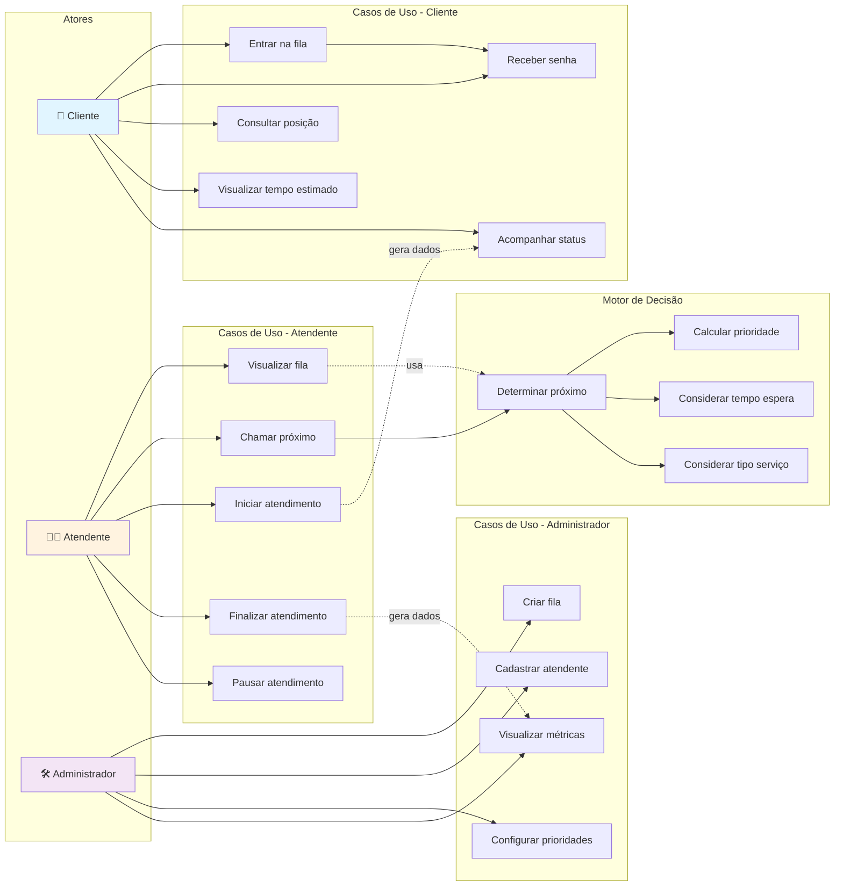

# Diagrama de Casos de Uso - QFlow

## Visão Geral

Diagrama UML representando os casos de uso do QFlow, organizado por atores e funcionalidades do MVP.

---

## Descrição dos Casos de Uso

### 👤 Cliente

| Caso de Uso | Descrição |
|---|---|
| **Entrar na fila** | Cliente se posiciona na fila do atendimento |
| **Receber senha** | Sistema gera um número/código de identificação |
| **Consultar posição** | Cliente visualiza sua posição atual na fila |
| **Visualizar tempo estimado** | Sistema calcula e exibe o tempo de espera estimado |
| **Acompanhar status** | Cliente monitora em tempo real o status do seu atendimento |

### 👨‍💼 Atendente

| Caso de Uso | Descrição |
|---|---|
| **Visualizar fila** | Atendente vê a lista de pessoas aguardando |
| **Chamar próximo** | Atendente chama o próximo atendimento (conforme algoritmo) |
| **Iniciar atendimento** | Atendente inicia o atendimento do cliente |
| **Finalizar atendimento** | Atendente encerra o atendimento e registra informações |
| **Pausar atendimento** | Atendente coloca o atendimento em pausa/suspenso |

### 🛠️ Administrador

| Caso de Uso | Descrição |
|---|---|
| **Criar fila** | Admin cria uma nova fila de atendimento |
| **Cadastrar atendente** | Admin registra novos profissionais no sistema |
| **Configurar prioridades** | Admin define as regras de priorização (pesos e fatores) |
| **Visualizar métricas** | Admin acompanha indicadores de desempenho |

### 🧠 Motor de Decisão

| Caso de Uso | Descrição |
|---|---|
| **Calcular prioridade** | Avalia o nível de prioridade do cliente |
| **Considerar tempo espera** | Analisa quanto tempo o cliente está aguardando |
| **Considerar tipo serviço** | Verifica qual tipo de atendimento é necessário |
| **Determinar próximo** | Aplica algoritmo para definir próximo atendimento |

---

## Relacionamentos

- **Inclusão** (→): Indicam fluxo obrigatório entre casos de uso
- **Associação Tracejada** (-.->): Indicam uso ou dependência

### Fluxos Principais

1. **Entrada do Cliente**
   - Cliente → Entrar na fila → Receber senha

2. **Atendimento**
   - Atendente → Visualizar fila → Chamar próximo (usa Motor de Decisão) → Iniciar atendimento

3. **Encerramento**
   - Finalizar atendimento → Gera dados para Métricas e acompanhamento do Cliente

4. **Configuração (Admin)**
   - Criar fila → Cadastrar atendente → Configurar prioridades

